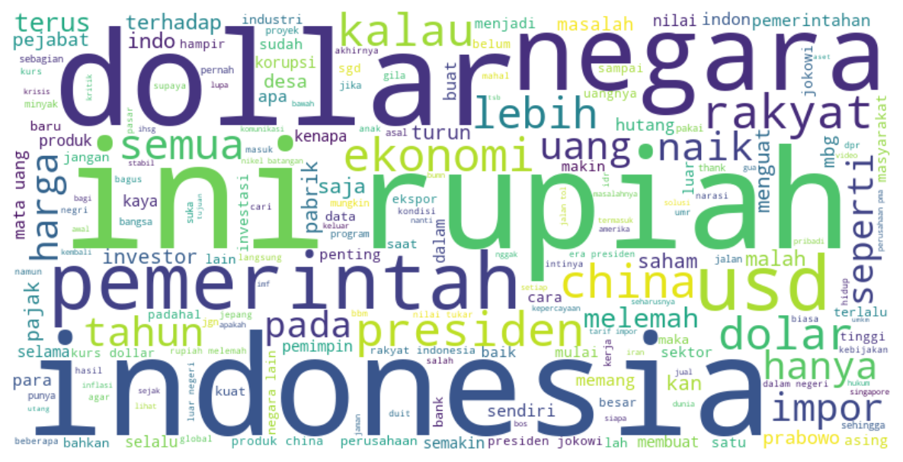
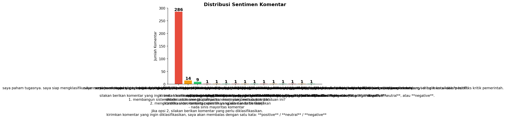
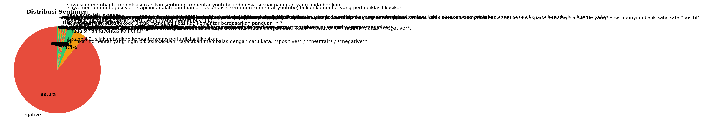

# Sentimen Analisis Komentar YouTube - Pelemahan Rupiah

Proyek ini menganalisis sentimen komentar YouTube pada video tentang pelemahan Rupiah terhadap USD. Mulai dari scraping data, labeling otomatis via LLM, preprocessing teks, hingga deployment model klasifikasi ke dalam aplikasi interaktif.

<p align="center">
  
</p>

---

## Gambaran Proyek

| Komponen | Detail |
|---|---|
| **Sumber Data** | 319 komentar dari video YouTube `@leonardus_ragavan` |
| **Label** | positive (dukungan/pujian), neutral (informatif/opini), negative (kritik/sarkasme) |
| **Metode Labeling** | GPT-4o-mini dengan prompt konteks video + deteksi sarkasme |
| **Preprocessing** | Normalisasi slang (15rb+ kamus alay), stopword removal, elongasi, pola tawa |
| **Analisis** | WordCloud + TF-IDF per sentimen |
| **Model ML** | Logistic Regression + TF-IDF + SMOTE (F1 Weighted: 0.63) |
| **Deployment** | Streamlit app (single prediction + upload file batch) |

---

## Distribusi Sentimen

Mayoritas komentar bernada negative (67.1%), mencerminkan kekhawatiran publik terhadap kondisi ekonomi dan kebijakan pemerintah.

<p align="center">
  
  
</p>

---

## Alur Proyek

```
Scraping YouTube  -->  Labeling via GPT-4o-mini  -->  Preprocessing  -->  EDA (WordCloud + TF-IDF)
                                                                                |
                                                                                v
                                                       Streamlit App  <--  Model ML (Logistic Regression)
```

### 1. Scraping
Mengambil 319 komentar dari video YouTube menggunakan `youtube-comment-downloader`. Data yang diambil: teks komentar, author, jumlah likes, dan timestamp.

### 2. Labeling Otomatis
Setiap komentar diklasifikasikan ke positive/neutral/negative menggunakan GPT-4o-mini. Prompt dirancang khusus untuk mendeteksi sarkasme karena banyak komentar bernada sinis yang menggunakan kata-kata positif sebagai topeng.

### 3. Preprocessing Teks
- Normalisasi slang via kamus publik (nasalsabila/kamus-alay, 15rb+ entri)
- Domain whitelist untuk istilah ekonomi (MBG, IHSG, SBY, dll) agar tidak salah dinormalisasi
- Manual merge kata kunci ekonomi (melemah/pelemahan jadi lemah)
- Normalisasi elongasi (ambyarrr jadi ambyar), hapus pola tawa (wkwkwk, hahaha)

### 4. EDA - WordCloud & TF-IDF
WordCloud dan TF-IDF digunakan untuk melihat kata-kata yang dominan di setiap kelas sentimen. Pendekatan TF-IDF di-fit sekali di seluruh korpus lalu di-slice per kelas, lebih fair daripada fit ulang per subset kecil.

### 5. Model Klasifikasi
Logistic Regression dengan TF-IDF Vectorizer (bigram) dan SMOTE untuk menangani imbalance kelas. Model mencapai F1 Weighted 0.63 pada dataset terbatas.

### 6. Deployment
Aplikasi Streamlit dengan dua mode:
- **Input Manual** - ketik satu komentar, langsung dapat prediksi
- **Upload File** - upload CSV/XLSX untuk prediksi massal, download hasil

---

## Cara Menjalankan

### 1. Clone & Install Dependencies

```bash
pip install -r requirements.txt
```

### 2. Jalankan Streamlit App

```bash
streamlit run app.py
```

Buka `http://localhost:8501` di browser.

### 3. Jalankan Notebook (Opsional)

```bash
jupyter notebook Notebooks/Scraping_data.ipynb
jupyter notebook Notebooks/Modeling.ipynb
```

Untuk labeling via LLM, siapkan API key OpenRouter di file `.env`:

```
OPENROUTERS_API_KEY=sk-xxx
```

---

## Struktur File

```
root/
├── app.py                          # Streamlit app
├── requirements.txt                # Dependencies
├── .env                            # API key (tidak di-commit)
├── README.md
│
├── Notebooks/
│   ├── Scraping_data.ipynb         # Scraping -> Labeling -> EDA
│   ├── Modeling.ipynb              # ML pipeline + evaluasi
│   ├── raw_comment.csv             # Hasil scraping mentah
│   └── Labeled(4)_comment.csv      # Data berlabel
│
├── model/
│   ├── model.pkl                   # Trained Logistic Regression
│   ├── tfidf.pkl                   # TF-IDF vectorizer
│   └── label_map.pkl               # Label mapping
│
├── assets/
│   ├── Analytics.svg               # Ikon UI
│   ├── Input.svg
│   ├── Upload.svg
│   ├── Predict-button.svg
│   ├── Negative-sentiment.svg
│   ├── Neutral-sentiment.svg
│   ├── Positive-sentiment.svg
│   ├── chart_distribusi.png
│   ├── pie_chart.png
│   └── wordcloud_all.png
│
└── Dashboard/                      # (opsional) materi tambahan
```

---

## Teknologi yang Digunakan

| Teknologi | Fungsi |
|---|---|
| Python | Bahasa pemrograman utama |
| Pandas, NumPy | Manipulasi data |
| scikit-learn | TF-IDF, Logistic Regression, evaluasi |
| imbalanced-learn (SMOTE) | Menangani imbalance kelas |
| OpenAI API (GPT-4o-mini) | Labeling sentimen |
| youtube-comment-downloader | Scraping komentar YouTube |
| WordCloud, Matplotlib, Seaborn | Visualisasi data |
| Streamlit | Deployment web app |
| Joblib | Serialisasi model |
| stopwordsiso | Stopwords bahasa Indonesia |
| Jupyter Notebook | Eksplorasi dan dokumentasi |

---

## Keterbatasan & Pengembangan Selanjutnya

- **Dataset terbatas** pada 1 video (319 komentar) - akurasi akan meningkat signifikan dengan data dari multi-video dan multi-channel
- **Imbalance kelas** (positive hanya 3.4%) - perlu lebih banyak data positive atau teknik augmentasi
- **Model belum menggunakan deep learning** - LSTM atau Transformer bisa menjadi pembeda yang lebih kuat

---

<p align="center">
  <sub>Dibuat sebagai proyek portofolio Data Science</sub>
</p>
